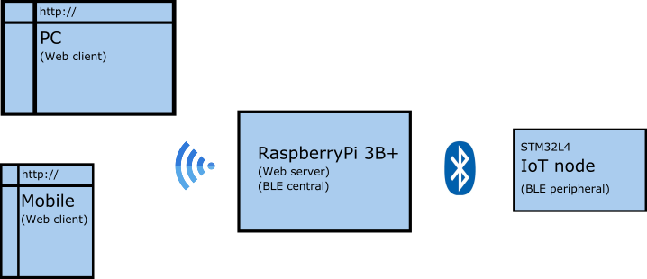
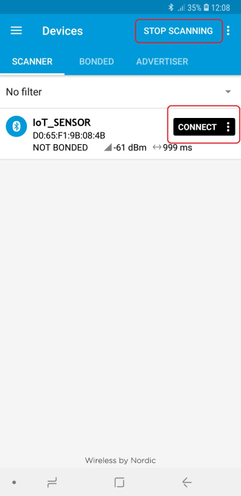
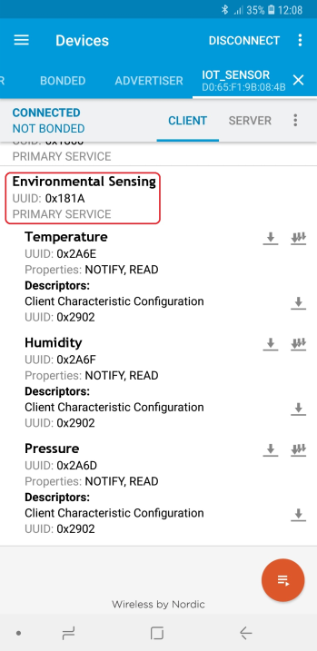
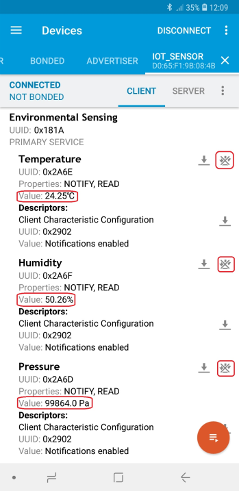
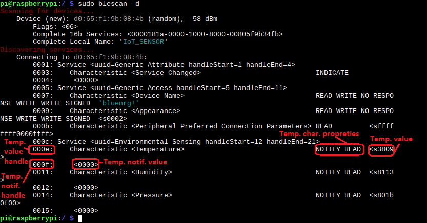
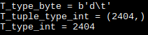
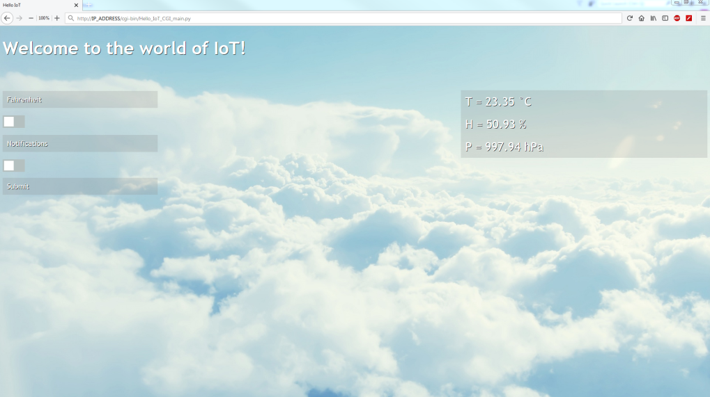
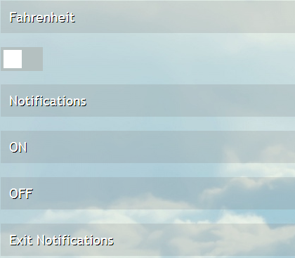

# Hello IoT

## Introduction
This is an entry-level project to the world of connected devices, hence the title `Hello IoT`.

All code in this project is open-source.
[License](#license)

Hardware:
- [RaspberryPi model 3B+](https://www.raspberrypi.org/products/raspberry-pi-3-model-b-plus/)
- [STM32L4 Discovery kit IoT node (ref B-L475E-IOT01A)](https://www.st.com/en/evaluation-tools/b-l475e-iot01a.html)
- Smartphone with [nRF Connect for Mobile](https://play.google.com/store/apps/details?id=no.nordicsemi.android.mcp) for Android or [LightBlue](https://itunes.apple.com/gb/app/lightblue-bluetooth-low-energy/id557428110?mt=8) for iPhone (*optional)

IDE (free):
- [Microsoft Visual Studio Community 2017](https://visualstudio.microsoft.com/vs/community/)
- [Mbed Online Compiler](https://os.mbed.com/)


Programming / script languages:
- C++
- Python 3.5
- HTML/CSS
- XML-AJAX
- Javascript

## Concept

Project can be divided into two parts:

- BLE central/peripheral communication
- Web client/server communication

When client connects to **RaspberryPi** via `WiFi` or `LAN`, through its `IP address`, it initiates connection to a self-advertising **IoT node** and reads `GATT Environmental Sensing Service Characteristics` (temperature, humidity and pressure), which are then written to a text file. Values are updated in an `HTML` page by a `XMLHttpRequest`.
Client can also select between one-time read or enables `Notifications`.

(*Note that this was developed for a local network.*)



## Running BLE application on STM32L4 Discovery kit IoT node

### Building the application

Firmware for this board was written using **Mbed Online Compiler** and was published at [my mbed profile](https://os.mbed.com/users/jernej_vrscaj/code/Hello_IoT_BLE/).

Also its initial commit (file revision: [*0:0681ebb27b3c*](https://os.mbed.com/users/jernej_vrscaj/code/Hello_IoT_BLE/rev/0681ebb27b3c/)) is uploaded to this folder [/mbed](./mbed)

Code is based on [mbed-os-example-ble](https://github.com/ARMmbed/mbed-os-example-ble) and modified to support `Environmental Sensing Service`.

One can import this example in a Mbed Online Compiler, given that it has an account (it is free). There it can be compiled and downloaded to this board.

### Checking for success

Screen captures depicted below show what is expected from this example if the scanner used is **nRF Connect**.

- Start a scan and connect to a device named **IoT_SENSOR**.



- Discover the services and the characteristics on the device. The **Environmental Sensing** service has the UUID `0x181A` with characteristics **Temperature** `0x2A6E`, **Humidity** `0x2A6F` and **Pressure** `0x2A6D`.



- At this point you can read or register for notifications. In figure below, all characteristics have been registered for notification and their values should change every second.



## RaspberryPi 3B+ setup

### BLE (Bluetooth Low Energy) interface

Python module [Bluepy](https://github.com/IanHarvey/bluepy) is used to interface with Bluetooth on Linux.

After package installation, you can use command-line `$ sudo blescan -d` which scans for BT devices, connects to them and displays their services.

Note that Environmental characteristic values here are in type `str`!
For a temperature measurement that is `s'3809'` and it can be represented as a `hex` value `0x0938`. Decimal value would then be `2360` or final `23.60`



However in Python script these values are read as type `byte`.

```python
# Read data from Temperature characteristic #
uuid_ch_temp = btle.UUID('00002a6e-0000-1000-8000-00805f9b34fb')
ch_temp = svc_env.getCharacteristics(uuid_ch_temp)[0]
val_temp = ch_temp.read()
print('T_type_byte =',val_temp)
temp_tuple = struct.unpack('h', val_temp)
print('T_tuple_type_int =',temp_tuple)
print('T_type_int =',temp_tuple[0])
```

Temperature reading outputs `utf-8` encoded type byte value `b'd\t'` consisting of two characters `d`, which is `0x64` and `t as a TAB`, which is `0x09`.
With a help of Python's [struct](https://docs.python.org/2/library/struct.html) model this can be converted to an integer value of `0x0964` or rather `2404`. Please note that `struct.unpack` outputs a tuple, so read the value by index `temp_tuple[0]`.



To turn notifications ON, write type byte value `b'\x01\x00'` to temperature notification handle `000f`.

```python
# Temperature notification ON #
sensor.writeCharacteristic(ch_temp.valHandle+1, b'\x01\x00')
```

Useful links:
- [RaspberryPi and BLE](https://www.elinux.org/RPi_Bluetooth_LE)
- [Bluepy documentation](https://ianharvey.github.io/bluepy-doc/)
- [(Bluepy) Working with notifications](https://ianharvey.github.io/bluepy-doc/notifications.html)


### CGI (Common Gateway Interface) setup

Managing CGI scripts is done by [Apache Web Server](https://www.raspberrypi.org/documentation/remote-access/web-server/apache.md).

After package installation, Apache server is running (if not `$ sudo service apache2 start`). Remote client can now execute Python scripts remotely by entering an IP address of a RaspberryPi and a Python script name in a browser, in our case: `http://IP_ADDRESS/cgi-bin/Hello_IoT_CGI_main.py`

To accomplish this, few settings need to be applied:
- Save Python scripts in Unix-like endings (only LF), if you work on Windows
- Script starts with `#!/usr/bin/python3` as it should be executed in python3
- Format the output so that browser can understand it. Before any other outputs, you must add `print('Content-Type: text/html \n')`. Make sure it has new-line feed at the end and preferably write this line as close as possible to the beginning of a script file (if you enable debugging through web with `import cgitb` and `cgitb.enable()`, e.g. if some imported module is missing, it should display error in a browser as it would in command-line).
- Add the following (root access needed) in `/etc/apache2/conf-avaible/serve-cgi-bin.conf`

```
ScriptAlias /cgi-bin/ /usr/lib/cgi-bin/
<Directory "/usr/lib/cgi-bin">
  AllowOverride None
  Options +ExecCGI -MultiViews +SymLinksIfOwnerMatch
  Require all granted
  AddHandler cgi-script .cgi
  AddHandler cgi-script .py
  Allow from all
  Order allow,deny
</Directory>
```
This file should also be in `/etc/apache2/conf-enabled/` by default; if not add it with `$ sudo a2enconf serve-cgi-bin`
After each Apache configuration you must restart it: `$ sudo service apache2 restart`.
- Publish (copy) Python script `.cgi` or `.py` in `/usr/lib/cgi-bin` (with root rights) and make it executable by anyone `$ sudo chmod +x /usr/lib/cgi-bin/Hello_IoT_CGI_main.py`, or limit it to the Apache service (user: *www-data*) `$ sudo chown www-data:www-data Hello_IoT_CGI_main.py` and `$ sudo chmod 750 Hello_IoT_CGI_main.py`. This way you can no longer change script as a user: *pi*. Apply the same for `Hello_IoT_CGI_notify.py`
- Finally enable cgi module: `$ sudo a2enmod cgi`

Useful links:
- [Python and Web servers](https://docs.python.org/2/howto/webservers.html)
- [Apache CGI configuration on RPI](https://www.raspberrypi.org/forums/viewtopic.php?t=148254)

### Web access

Apache server has its own default folder `/var/www/html` for serving HTML files. So any access to RPI with `http://IP_ADDRESS/` defaults here. If Apache is configured properly, by entering previous address, you should get this [index](https://www.codepowered.com/) page.

In our case, this is the folder for storing environmental values in a text file `env_val.txt`. You need root rights to copy files in this folder. For Apache service to open, write and `XMLHttpRequest` to read the file you should set owner to `$ sudo chown www-data:www-data env_val.txt` and access rights to `$ sudo chmod 744 env_val.txt`.

When running notification session, all value updates are stored in this file and overwritten with a next session.

This folder must also contain two background images for HTML page, located in this repository folder [/html](./html)

Main HTML page image: `above_the_clouds_4-wallpaper-1920x1080.jpg` [image web source](http://wallpaperswide.com/above_the_clouds_4-wallpapers.html)

Error HTML page image: `Nature___Sundown_Golden_sunset_above_the_clouds_042961_23.jpg` [image web source](https://www.zastavki.com/eng/Nature/Sundown/wallpaper-42961.htm)

Same permissions as for the text file can be applied to these two images as well.

## Running Hello IoT application

In your favorite remote browser, desktop or mobile, enter `http://IP_ADDRESS/cgi-bin/Hello_IoT_CGI_main.py`

*Note that if you use browser on RPI then replace `IP_ADDRESS` with `localhost`.*

RaspberryPi connects to IoT node, read characteristic values, saves it in a text file and `XMLHttpRequest` reads those values and updates them on HTML page.



Default temperature scale is Celsius, but can be switched to Fahrenheit by toggling the checkbox `Fahrenheit` and submitting the value. Readings are done again, these time calculated to Fahrenheit.

 

### Notifications menu

To enter notification menu toggle the checkbox `Notifications` and submit the value.

Pressing the submit button `ON` will call script `Hello_IoT_CGI_notify.py` at `http://IP_ADDRESS/cgi-bin/Hello_IoT_CGI_notify.py`



This script will loop forever and values will be updated every second (by default). Temperature can be displayed in Fahrenheit by toggling the checkbox `Fahrenheit` before submitting the button `ON`.
To stop notifications either press button `OFF` and stay in the notification menu, or press button `Exit Notifications` and return to the main menu. This will call script `Hello_IoT_CGI_main.py` which *kills* the script `Hello_IoT_CGI_notify.py` with a `KeyboardInterrupt` signal.

*Firefox users*: Note that before pressing buttons `OFF` or `Exit Notifications` you must stop the page loading by pressing  in a browser.

*(I don't know if this is a Firefox feature, because in Chrome and Internet Explorer this step can be skipped.)*

### Error handling

If something goes wrong, exeptions are raised through script and HTML page `Error` is returned with an error type.


### HTML page references

HTML pages are embedded in Python scripts and are send to browser via `print` statements.

For future reference they are included in folder [/html](./html) as a single `.html` file.

*Note that environmental values are hard-coded.*

To open HTML page with a background image in the same folder, url path of the image is changed

from

`background: url(/above_the_clouds_4-wallpaper-1920x1080.jpg) no-repeat center fixed;`

to

`background: url(above_the_clouds_4-wallpaper-1920x1080.jpg) no-repeat center fixed;`

### Connection parameters

In mbed application `Hello IoT BLE`, advertising time and sensor values update interval on connection, are defined in file `main.cpp`, in [ms].
```
#define ADVERTISING_INTERVAL 1000
#define UPDATE_VALUES_INTERVAL 1000
```
Changing notification update times, one should re-define values in three places.

- File 1: `main.cpp`
```
#define UPDATE_VALUES_INTERVAL 1000
```

- File 2: `Hello_IoT_CGI_notify.py`
```python
# Sensor values update interval in connection mode, in seconds #
UPDT_INT = 1.0
```

- File 3: `Hello_IoT_CGI_main.py`
```javascript
setInterval(function(){updateValues(callback);}, 1000);
```

However you could just change the definition in `main.cpp` and leave the others, as this is a matter of code optimisation.

*Note that when notifications are ON, BLE connection is dropped after 10 minutes, probably due to RaspberryPi's central role in connection mode. Result is `504 Gateway Timeout`.*

## License

Mbed code is avaiable under [Apache 2.0 License](http://www.apache.org/licenses/LICENSE-2.0).

All other code is published under [MIT License](LICENSE.md) and is free of use and without warranty.
